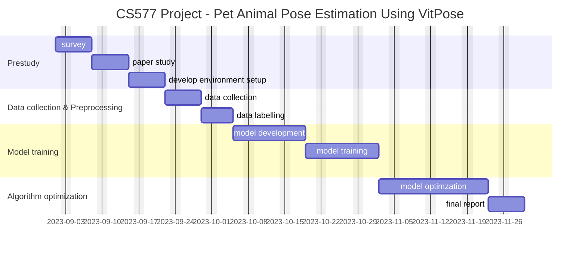

CS577 Project Proposal

# Project Title

Pet Animal Pose Estimation Using VitPose

# Team Members

- Wang Junjie
- Hao Chongchong
- Gu Haijun

# Problem Description

Over the past few years, research in computer vision for animal pose estimation has expanded significantly in various directions. However, when we compare the performance of animal post estimation with human pose estimation, the animal pose estimation still has much room to improve [1]. Animal pose estimation, like human pose estimation, involves determining the position of various body parts in an image or video. However, animal pose estimation is more challenging because of the diversity of species and the unique anatomical features of each animal, as well as the unique poses they adopt that cannot be replicated by humans. E.g., pose estimation for a giraffe, a goat, and a beaver would require three completely different skeletons.

In this project, we are trying to use VitPose model to achieve pet animal (cats & dogs) pose estimation, which can be widely used for pet health caring, remote monitoring, aiding rehabilitation, body language analysis, etc. We plan to leverage VitPose+ pre-trained  result as a knowledge transferring for reducing training cost. If possible, we also plan to explore methods as to improve the accuracy with lower cost. This might be including learning strategy adjustment, transfer learning, etc.

# Brief Survey

Most state-of-the-art methods focus on human body pose detection and tracking. However, some models were developed to be used with animals and cars (object pose estimation). Animal pose estimation comes with additional challenges, such as limited labeled data (need to collect data and annotate images manually) and a large number of self-occlusions. Therefore, datasets for animals are usually small and include limited animal species. When working with limited data available and small datasets, active learning and data augmentation provide useful methods. Both techniques help to train vision algorithms more effectively and reduce the annotation work for custom AI model training[2]. 

Most popular pose estimation methods,

* OpenPose
* VitPose
* High-Resolution Net (HRNet)
* DeepCut
* AlphaPose
* Deep Pose
* PoseNet
* Dense Pose

All approaches for pose estimation can be grouped into two categories,

*  Bottom-up methods estimate each body joint first and then group them to form a unique pose. Bottom-up methods were pioneered with DeepCut
* Top-down methods run a person detector first and estimate body joints within the detected bounding boxes

These top-down approaches directly leverage existing techniques for single-person pose estimation, but suffer from early commitment: if the person detector fails–as it is prone to do when people are in close proximity–there is no recourse to recovery. Furthermore, their runtime is proportional to the number of people in the image, for each person detection, a single-person pose estimator is run[3]. The same logic applies to the problem of animal pose detection. In contrast, bottom-up approaches are attractive as they offer robustness to early commitment and have the potential to decouple runtime complexity from the number of people in the image. Yet, bottom-up approaches do not directly use global contextual cues from other body parts and other people. This is a perfect choice to animal pose detection due a lack of sufficient referable training result.

ViTPose employs a plain and non-hierarchical vision transformer [4] as the backbone to extract features for an input person instance or image, determined by the adopted pose estimation paradigm, *i.e*., either the top-down paradigm or the bottom-up paradigm. The backbone is pre-trained with masked image modeling pretext tasks, *e.g*., MAE [5], to provide a good initialization. Then, a lightweight decoder, which is composed of two deconvolution layers and one prediction layer, further processes the extracted features by up sampling and regression to get the heatmaps of different keypoints. It is noteworthy that the associate maps are also regressed together with the heatmaps for the bottom-up paradigm. Despite no elaborate task-specific designs, ViTPose achieves a state-of-the-art (SOTA) performance of 80.9 AP on the challenging MS COCO test-dev set for human keypoint detection[6]. Considering its super generalization and flexibility, we plan to use it for animal pose estimation.

# Preliminary Plan

# Reference
1. [The Complete Guide to Animal Pose Estimation in 2023: Tools, Models, Tutorial](!https://supervisely.com/blog/animal-pose-estimation/)

2. [Human Pose Estimation with Deep Learning - Ultimate Overview in 2023](!https://viso.ai/deep-learning/pose-estimation-ultimate-overview/)

3. Z. Cao, G. Hidalgo, T. Simon, S. Wei and Y. Sheikh, "OpenPose: Realtime Multi-Person 2D Pose Estimation Using Part Affinity Fields" in IEEE Transactions on Pattern Analysis & Machine Intelligence, vol. 43, no. 01, pp. 172-186, 2021.

4. A. Dosovitskiy, L. Beyer, A. Kolesnikov, D. Weissenborn, X. Zhai, T. Unterthiner, M. Dehghani, M. Minderer, G. Heigold, S. Gelly *et al.*, “An image is worth 16x16 words: Transformers for image recognition at scale,” in *International Conference on Learning Representations*, 2020

5. K. He, X. Chen, S. Xie, Y. Li, P. Dollar, and R. Girshick, “Masked autoencoders are scalable vision learners,” in Proceedings of the IEEE/CVF Conference on Computer Vision and Pattern Recognition (CVPR), 2022, pp. 16 000–16 009

6. Yufei Xu, Jing Zhang, Qiming Zhang, Dacheng Tao, "ViTPose++: Vision Transformer Foundation Model for Generic Body Pose Estimation" in arXiv:2212.04246

   

# Github
All docs and code will be updated at https://github.com/IIT-Project/CS577